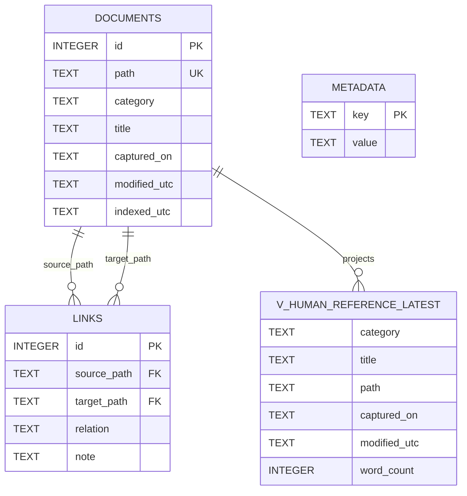

# Human Reference DB

## Why This Exists

This database is a local knowledge map for portfolio docs, so you can answer:

- What was captured most recently?
- Which transcripts or key points changed?
- Which notes reference other notes?

Think of it as a searchable library index for `docs/transcripts`, `docs/research`, and `docs/theory`.

## Imagineer Mental Model

- `documents` = each markdown note as one indexed card.
- `links` = directed references between cards (`source -> target`).
- `metadata` = index-level settings and timestamps.
- `v_human_reference_latest` = a sorted feed view from `documents`.

## Schema At A Glance

| Object | Purpose | Key Fields |
| --- | --- | --- |
| `documents` | Canonical indexed document records | `id`, `path` (unique), `category`, `title`, `captured_on`, `modified_utc`, `word_count` |
| `links` | Cross-reference edges extracted from markdown links | `source_path`, `target_path`, `relation` |
| `metadata` | Build/index metadata | `key`, `value` |
| `v_human_reference_latest` | Ready-to-query recency feed | `category`, `title`, `path`, `captured_on`, `modified_utc`, `word_count` |

## Relationship Rules

- `links.source_path` references `documents.path`.
- `links.target_path` references `documents.path`.
- Both references are `ON DELETE CASCADE` and `ON UPDATE CASCADE`.
- The link extractor currently indexes markdown links matching:
  - `` `docs/peanut/transcripts/<name>.md` ``
  - `` `docs/peanut/research/<name>.md` ``
  - `` `docs/peanut/theory/<name>.md` ``

This means ER tools can now infer the link-table relationships directly from foreign keys.

## ER Diagram

## One-Click Commands

- Rebuild DB:
  - `make human-reference-db`
- Latest feed:
  - `make human-reference-latest`
- Transcript + key points feed:
  - `make human-reference-transcripts`
- Recent changes feed:
  - `make human-reference-changes`
- Relationship map feed:
  - `make human-reference-relationships`

Optional tuning:

- `make human-reference-latest HUMAN_REFERENCE_LIMIT=50`
- `make human-reference-changes HUMAN_REFERENCE_SINCE_HOURS=72`

## SQL Viewer Pack

Use `.archive/live_archive/legacy_human_reference/human_reference_queries.sql` in your DB viewer for:

- latest docs
- category totals
- transcript/key-point/theory recency feeds
- source->target relationship maps
- foreign-key diagnostics for ER rendering
