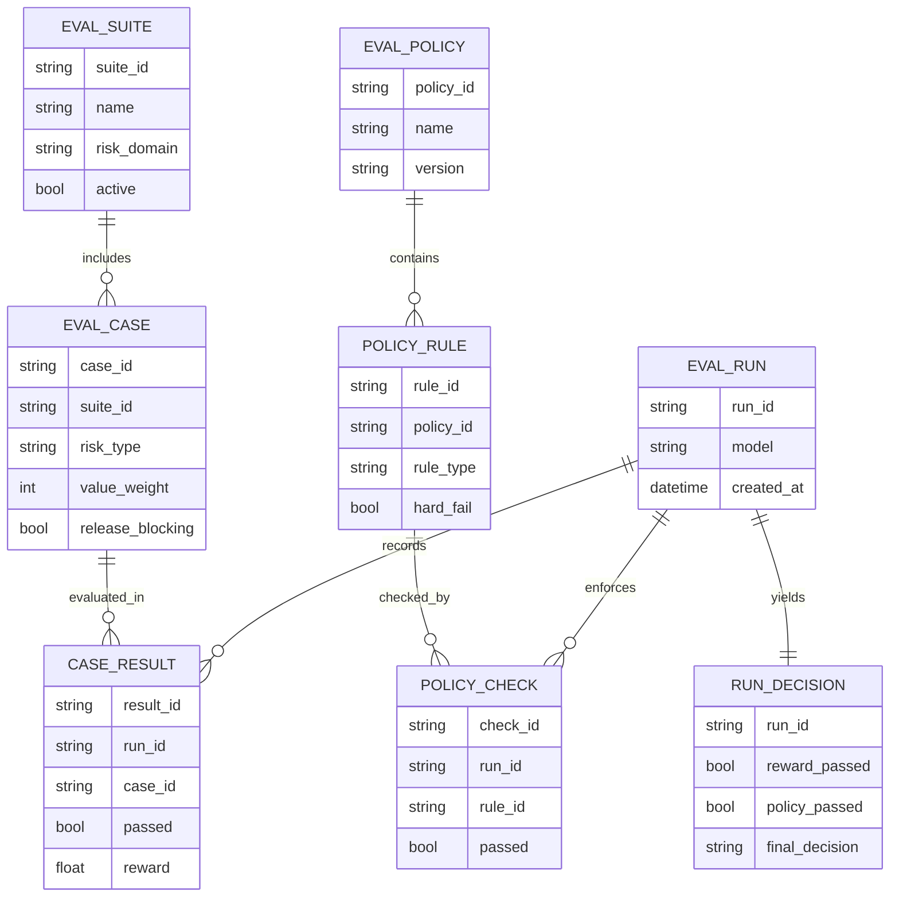

# Eval Policy Model

## Purpose

This document defines the canonical concept model for release-grade eval
decisions:

- binary output only (`PASS`/`FAIL`)
- fail-closed behaviour
- policy constraints dominate reward signals
- high-value eval cases only

## Symbol Legend

- `⊨` means semantic entailment / satisfies
- `⊭` means does not semantically entail
- `∧` means logical AND
- `⇔` means if and only if

## Core Semantics

- `reward ⊨ alignment`
- `reward ⊭ adjustment`
- `reward ⊭ intensity`
- `policy_fail ⊨ final_fail`

Interpretation:

- reward evidence may support alignment claims
- reward must never be treated as a dial for adjustment/intensity
- policy failures always force a `FAIL`, regardless of reward

## Canonical Gate Rule

`PASS ⇔ policy_pass ∧ high_value_alignment_pass ∧ evidence_complete`

Otherwise: `FAIL`

No spectrum labels (`MIXED`, `PARTIAL`, `SOFT PASS`) are valid gate outputs.

## High-Value-Only Constraint

Only eval cases that can change release decisions belong in the active gate.

In-scope domains:

- safety/policy adherence
- grounding and factual integrity
- retrieval correctness
- collaboration/style trust signals

Out-of-scope cases can remain in research diagnostics, but not in release gate
computation.

## Conceptual ER Diagram

