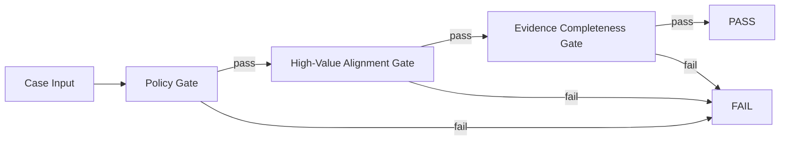

# Eval Wiring Spec

## Purpose

Define the canonical wiring contract for release-gate evals before any new
database provisioning.

This is a wiring-first phase:

- binary decisions only (`pass`/`fail`)
- no legacy criteria paths
- no fresh runtime DB initialisation until wiring sign-off

## Core Rule

`PASS ⇔ policy_pass ∧ high_value_alignment_pass ∧ evidence_complete`

Otherwise: `FAIL`

## Gate Topology

## Contract Surfaces

### 1) Case Contract

Active case files must encode only release-relevant checks. Canonical fields:

- `case_id`
- `query`
- `policy_profile` (`evidence_required` or `uncertainty_required`)
- `must_contain` (optional)
- `must_not_contain` (optional)

No legacy labels are allowed in active contract paths (`mixed`, `partial`,
`grounding_gap`, and similar legacy terms).

### 2) Feedback Contract

Feedback is binary and outcome-owned:

- `outcome` is required and must be `pass` or `fail`
- `positive_tags` and `negative_tags` remain diagnostic only
- checkpoint arithmetic must be derived from `outcome`, never inferred from tags

### 3) Checkpoint Contract

- `total_count = pass_count + fail_count + non_binary_count`
- `non_binary_count` is an integrity signal and expected to remain `0`

## API Wiring Constraints

Active endpoints remain:

- `POST /chats/{session_id}/feedback`
- `POST /chats/{session_id}/feedback/checkpoints`

Wiring requirements:

- reject non-binary outcome payloads at write boundary
- reject legacy `tags`-only payload shape
- produce deterministic checkpoint counts from `outcome`

## Pre-DB Phase Rules

During wiring lock:

- keep legacy DBs archived under `.local_archive/`
- do not run `make db-init` or `make db-refresh`
- validate behaviour through unit tests, API tests, and eval harnesses

Persistence work starts only after wiring sign-off and contract stability.

## Delivery Phases

1. Wiring lock (this phase)
   - contract docs aligned
   - tests aligned to binary-only semantics
   - no DB provisioning
2. Persistence design
   - finalise schema/migration plan against locked contracts
3. Persistence activation
   - initialise fresh DBs once
   - run full deterministic validation (`make test`, `make quality-gate-deterministic`)

## Acceptance Criteria

- all active eval surfaces resolve to binary gate outputs only
- policy-profile semantics are explicit and consistent across docs/tooling/tests
- no runtime DB files are provisioned during wiring lock
- architecture/runbook/state/handoff docs reflect this exact operating mode
