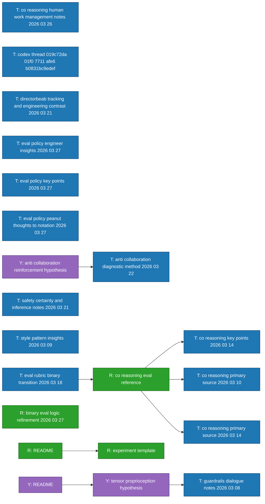

# Reference Graph

Generated from markdown links across transcripts, research, and theory.

- generated_utc: 2026-03-27T17:46:36Z
- nodes: 21
- edges: 8

## Legend

- `T:` transcript
- `R:` research
- `Y:` theory
