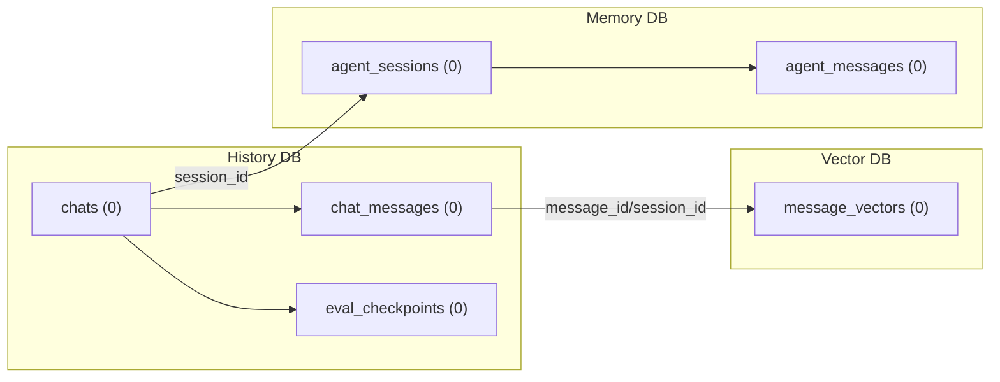
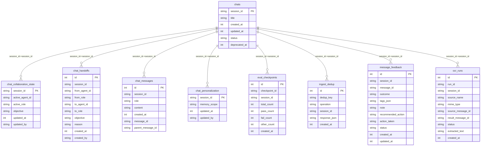
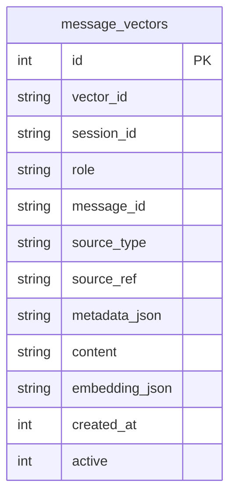
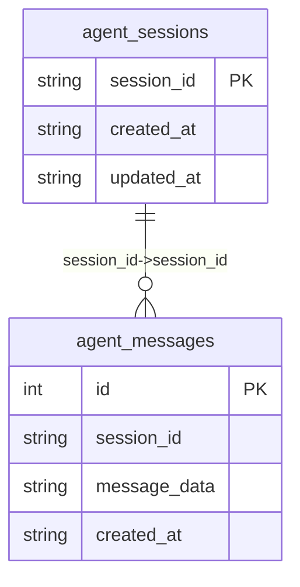

# Runtime DB Visuals

Generated ER-style visuals for runtime SQLite stores (history, vector, memory).

- generated_utc: 2026-03-27T17:49:38Z

## Runtime Data Flow (Cross-DB)

Logical relationships across runtime stores. These are application-level links, not SQLite foreign keys.

## History DB (.polinko_history.db)

- status: present
- tables: 9

### Row Counts

- `chat_collaboration_state`: 0
- `chat_handoffs`: 0
- `chat_messages`: 0
- `chat_personalization`: 0
- `chats`: 0
- `eval_checkpoints`: 0
- `ingest_dedup`: 0
- `message_feedback`: 0
- `ocr_runs`: 0

## Vector DB (.polinko_vector.db)

- status: present
- tables: 1

### Row Counts

- `message_vectors`: 0

## Memory DB (.polinko_memory.db)

- status: present
- tables: 2

### Row Counts

- `agent_messages`: 0
- `agent_sessions`: 0
