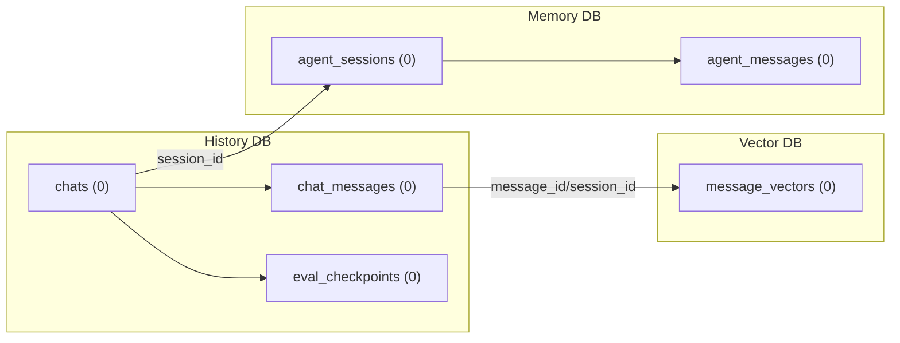

# Runtime DB Visuals

Generated ER-style visuals for runtime SQLite stores (history, vector, memory).

- generated_utc: 2026-03-27T19:53:51Z

## Runtime Data Flow (Cross-DB)

Logical relationships across runtime stores. These are application-level links, not SQLite foreign keys.

## History DB (.local/runtime_dbs/active/history.db)

- status: missing

## Vector DB (.local/runtime_dbs/active/vector.db)

- status: missing

## Memory DB (.local/runtime_dbs/active/memory.db)

- status: missing
