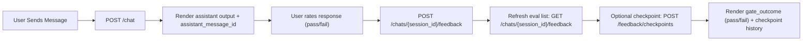

# UI Eval Adapter Contract

## Purpose

Define one stable UI-to-backend contract for chat plus binary eval operations.
This is the canonical integration surface for the new UI.

## Backend Endpoints

| Method | Path | Purpose |
| --- | --- | --- |
| POST | `/chat` | Send a user message and receive assistant output. |
| GET | `/chats/{session_id}/messages` | Render full thread with message IDs. |
| POST | `/chats/{session_id}/feedback` | Save binary eval for one assistant message. |
| GET | `/chats/{session_id}/feedback` | Render eval state in thread UI. |
| POST | `/chats/{session_id}/feedback/checkpoints` | Create fail-closed checkpoint summary. |
| GET | `/chats/{session_id}/feedback/checkpoints` | Render checkpoint history and gate outcome. |

## TypeScript Contract

```ts
export type HarnessMode = "live" | "fixture";
export type EvalOutcome = "pass" | "fail";
export type GateOutcome = "pass" | "fail";

export interface ChatRequest {
  message: string;
  session_id?: string;
  source_user_message_id?: string;
  harness_mode?: HarnessMode;
  fixture_output?: string;
}

export interface MemoryCitation {
  vector_id: string;
  session_id: string;
  source_type: string;
  source_ref: string | null;
  similarity: number;
  snippet: string;
  metadata: Record<string, unknown>;
}

export interface ChatResponse {
  output: string;
  session_id: string;
  assistant_message_id: string | null;
  prompt_version: string;
  memory_scope: string;
  context_scope: "global" | "local";
  memory_used: MemoryCitation[];
}

export interface MessageFeedbackRequest {
  message_id: string;
  outcome: EvalOutcome;
  positive_tags: string[];
  negative_tags: string[];
  note?: string;
  action_taken?: string;
}

export interface MessageFeedback {
  session_id: string;
  message_id: string;
  outcome: EvalOutcome;
  positive_tags: string[];
  negative_tags: string[];
  tags: string[];
  note: string | null;
  recommended_action: string | null;
  action_taken: string | null;
  status: "open" | "closed";
  created_at: number;
  updated_at: number;
}

export interface ChatFeedbackResponse {
  session_id: string;
  feedback: MessageFeedback[];
}

export interface EvalCheckpoint {
  checkpoint_id: string;
  session_id: string;
  total_count: number;
  pass_count: number;
  fail_count: number;
  non_binary_count: number;
  gate_outcome: GateOutcome;
  schema_version: string;
  created_at: number;
}

export interface ChatEvalCheckpointsResponse {
  session_id: string;
  checkpoints: EvalCheckpoint[];
}
```

## API Adapter (Reference)

```ts
type Json = Record<string, unknown>;

export interface PolinkoApiConfig {
  baseUrl: string; // example: http://127.0.0.1:8000
  apiKey: string;
}

export class PolinkoUiApi {
  constructor(private readonly cfg: PolinkoApiConfig) {}

  private async request<T>(path: string, init: RequestInit): Promise<T> {
    const res = await fetch(`${this.cfg.baseUrl}${path}`, {
      ...init,
      headers: {
        "content-type": "application/json",
        "x-api-key": this.cfg.apiKey,
        ...(init.headers ?? {}),
      },
    });
    if (!res.ok) {
      let detail = `HTTP ${res.status}`;
      try {
        const body = (await res.json()) as { detail?: string };
        if (body.detail) detail = body.detail;
      } catch {
        // no-op: keep fallback detail
      }
      throw new Error(detail);
    }
    return (await res.json()) as T;
  }

  sendChat(input: ChatRequest): Promise<ChatResponse> {
    return this.request<ChatResponse>("/chat", {
      method: "POST",
      body: JSON.stringify(input as Json),
    });
  }

  listMessages(sessionId: string): Promise<{ session_id: string; messages: unknown[] }> {
    return this.request(`/chats/${encodeURIComponent(sessionId)}/messages`, {
      method: "GET",
    });
  }

  submitFeedback(sessionId: string, payload: MessageFeedbackRequest): Promise<MessageFeedback> {
    return this.request<MessageFeedback>(
      `/chats/${encodeURIComponent(sessionId)}/feedback`,
      {
        method: "POST",
        body: JSON.stringify(payload as Json),
      }
    );
  }

  listFeedback(sessionId: string): Promise<ChatFeedbackResponse> {
    return this.request<ChatFeedbackResponse>(
      `/chats/${encodeURIComponent(sessionId)}/feedback`,
      { method: "GET" }
    );
  }

  createCheckpoint(sessionId: string): Promise<EvalCheckpoint> {
    return this.request<EvalCheckpoint>(
      `/chats/${encodeURIComponent(sessionId)}/feedback/checkpoints`,
      { method: "POST", body: "{}" }
    );
  }

  listCheckpoints(sessionId: string): Promise<ChatEvalCheckpointsResponse> {
    return this.request<ChatEvalCheckpointsResponse>(
      `/chats/${encodeURIComponent(sessionId)}/feedback/checkpoints`,
      { method: "GET" }
    );
  }
}
```

## Eval Interaction Flow



## Eval Tag Rules (UI Validation)

Positive tags allowed:

- `accurate`
- `high_value`
- `medium_value`
- `low_value`
- `recovered`
- `ocr_accurate`
- `grounded`
- `style`
- `complete`
- `useful`

Negative tags allowed:

- `ocr_miss`
- `grounding_gap`
- `style_mismatch`
- `default_style`
- `em_dash_style`
- `hallucination_risk`
- `needs_retry`

Binary rules:

1. `pass` requires at least one positive tag.
2. `pass` only allows `default_style` as negative tag (soft penalty).
3. `fail` requires at least one negative tag.
4. Tags are diagnostic only; checkpoint gate uses `outcome` only.

## Harness Rules for UI Testing

1. Default mode is `live` (real backend model path).
2. For deterministic UI smoke, send `harness_mode: "fixture"`.
3. Optionally set `fixture_output` for exact expected text in UI tests.
4. Do not use fixture outputs for quality gate decisions.

## Error Handling Matrix

| Status | Meaning | UI action |
| --- | --- | --- |
| 400 | Invalid eval/tag payload | Inline form error + keep draft. |
| 401 | Missing/invalid API key | Show auth error and block actions. |
| 404 | Session/message not found | Refresh thread list and prompt recovery. |
| 409 | Chat deprecated | Prompt user to create/switch chat. |
| 422 | Request schema invalid | Validate client payload and retry. |
| 429 | Rate limited | Backoff and retry with delay. |
| 500 | Integrity issue (for example non-binary data) | Show hard failure and stop checkpoint action. |
| 503 | Upstream/runtime unavailable | Retry affordance with status notice. |

## Acceptance Checklist (UI)

1. Thread render always keeps `assistant_message_id` for eval actions.
2. Eval submit path supports only `pass`/`fail`.
3. Feedback panel reflects `recommended_action` and `status`.
4. Checkpoint panel renders `gate_outcome` as explicit pass/fail.
5. Fixture mode is clearly labelled as test-only in the UI.
