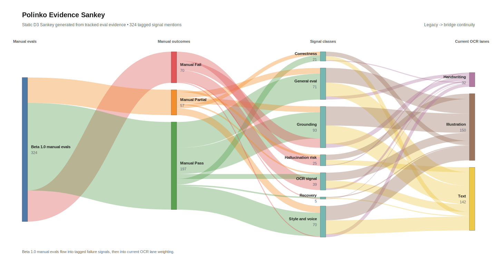

<!-- @format -->

# Eval Evidence Map

This folder is the tracked eval evidence lane.

Use it when you need:

- beta-era context
- case files and report snapshots
- the shortest path from eval artifacts to public proof

## Beta Meanings

- `beta_1_0`
  - binary-transition era
  - manual and screenshot-backed evaluation still carries real evidence weight
- `beta_2_0`
  - binary-operational era
  - flatter case/report structure and repeatable eval commands

Beta 1.0 and Beta 2.0 should be read together. Beta 1.0 explains the
transition into binary evals; Beta 2.0 shows the operationalized lane.

## Current Canonical Surfaces

- integrated manual-eval warehouse:
  - `.local/runtime_dbs/active/manual_evals.db`
  - rebuild with `make manual-evals-db`
- raw current runtime source:
  - `.local/runtime_dbs/active/history.db`
- live strict-gate observability plus tracked lane snapshots:
  - `.local/eval_reports/`
  - `/viz/pass-fail`
  - `/viz/pass-fail/data`

Manual evals and strict OCR gate reports answer different questions:

- manual evals capture human judgment and qualitative notes
- OCR gate reports preserve binary fail pressure
- `/viz/pass-fail` keeps the live chart on the active window and uses tracked
  eval files to keep the wider lane map visible below it
- tracked lane cards now expose direct links to:
  - the underlying tracked artifact
  - the promoted research note when that lane has one

Do not flatten one into the other.

## Tracked Gate Contract

- release outcomes stay `pass` / `fail`
- after `fail`, failure disposition is:
  - `retain`
  - `evict`
- `retain` keeps the failure in-scope as lane evidence
- `evict` is upstream case removal for malformed, noisy, or known-bad rows
- judge detail and qualitative notes can enrich a report, but they do not create
  a third gate state
- thin new lanes can begin as row-local human `pass` / `fail` evidence before
  larger automation

## What Is Tracked Here

### Beta 1.0

- curated historical evidence under `docs/eval/beta_1_0/`
- archived build snapshot material under
  `docs/eval/beta_1_0/build_snapshot_polinko-incase/`
- role in the public surface:
  - left-side/legacy evidence for `/portfolio/sankey-data`

### Beta 2.0

- active-era case files and report snapshots under `docs/eval/beta_2_0/`
- includes OCR, OCR recovery, OCR safety, hallucination, retrieval, file
  search, style, response behaviour, CLIP A/B, and operator burden
- append-only eval trace artifacts stay local under `eval_reports/`; they are
  not auto-promoted into the tracked beta surface
- current non-OCR promoted lane lives in the tracked style surface for
  co-reasoning reliability
  - latest tracked style snapshot:
    - `docs/eval/beta_2_0/style-20260512-185122.json`
    - `14/14` pass
- current retrieval-grounding surfaces now have fresh tracked snapshots:
  - retrieval recall:
    - `docs/eval/beta_2_0/retrieval-20260512-190149.json`
    - `12/12` pass
  - file search:
    - `docs/eval/beta_2_0/file-search-20260512-190149.json`
    - `5/5` pass
- current hallucination-boundary surface now has a fresh tracked snapshot:
  - `docs/eval/beta_2_0/hallucination-20260512-191438.json`
  - `9/9` pass
  - score contract:
    - judge score range: `0-10`
    - current minimum acceptable score: `5`
- current thin-lane operator burden surface lives in:
  - `docs/eval/beta_2_0/operator_burden_rows.json`
  - summarize with:
    - `make operator-burden-report`
    - the summary now surfaces:
      - pass anchors
      - retained failures
      - evicted failures
  - widen candidate rows locally with:
    - `python3 -m tools.build_behaviour_backlog_from_export --export-root /abs/path/to/CGPT-DATA-EXPORT`
- role in the public surface:
  - right-side/current evidence for `/portfolio/sankey-data`

## What Stays Local

- live runtime databases under `.local/runtime_dbs/active/`
- archived runtime databases under `.local/runtime_dbs/archive/`
- export-mined candidate backlogs under `.local/eval_cases/`
- full Beta 1.0 local snapshot databases and runtime state
- private exports, scratch screenshots, and raw local audit material

Do not commit the full Beta 1.0 snapshot wholesale. Promote only curated
evidence or explicitly approved artifacts.

## Interpretation Rule

- compare Beta 1.0 and Beta 2.0 by role, not by artifact neatness
- treat transcripts, screenshots, and raw reports as source evidence
- let decisions and public notes interpret the evidence, not replace it
