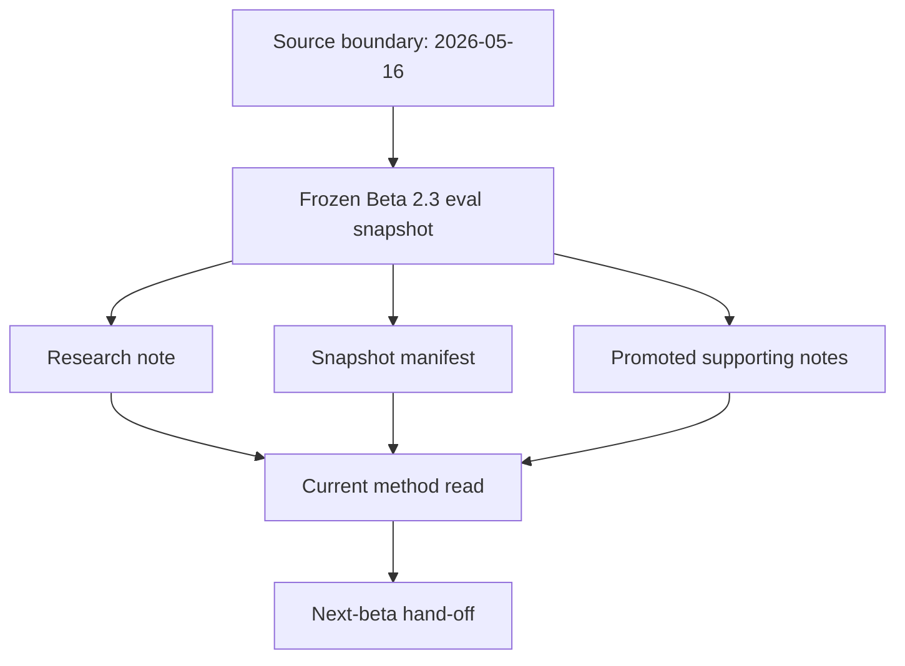

<!-- @format -->

# Beta 2.3 Eval Snapshot

- Snapshot date: `2026-05-19`
- Source boundary: `2026-05-16`
- Source commit: `642be28b1c4caad333965a629ddd9bd4d8b11332`

## Role

This folder freezes the Beta 2.3 research and evidence read before the next
beta cleanup and refactor work starts.

Beta 2.3 is the method boundary where OCR moves from stabilised current-image
replay into broader generalisation pressure. This snapshot preserves the
current read, evidence pointers, and high-level candidate-review counts.

## Diagram

## Snapshot Read

- OCR base at freeze:
  - growth stability: `25/25`
  - focus stability: `16/16`
  - active fail-history cohort: `0`
- intake at freeze:
  - transcript-mined OCR episodes remain a source surface
  - OCR-ready generalisation candidates widen intake
  - local review selected `24` cases from `2248` source candidates
  - selected lane mix: `9` illustration, `8` handwriting, `7` typed
- case governance at freeze:
  - OCR first gate stays `pass` / `fail`
  - retained OCR failures carry live seam evidence
  - evicted OCR cases document upstream noise cleanup
- broader method context at freeze:
  - co-reasoning is the first promoted non-OCR lane
  - operator burden remains the active thin lane
  - fail-pressure pulse remains hypothesis-only for non-OCR runs

## Tracked Contents

- [Snapshot manifest](./research_snapshot_manifest.json)
- [Beta 2.3 research note](../../research/beta_2_3_2026-05-16.md)
- [Fail-pressure pulse hypothesis](../../research/fail-pressure-pulse-hypothesis-2026-05-16.md)
- [OCR progress snapshot](../../research/ocr-progress-2026-05-08.md)
- [Co-reasoning promotion snapshot](../../research/co-reasoning-promotion-2026-05-08.md)
- [Operator burden signal shape](../../research/operator-burden-signal-shape-2026-05-12.md)
- [Beta 2.0 evidence files](../beta_2_0/)

## Source Handling

- Promote curated summaries, manifests, and selected public artefacts into
  `docs/eval/`.
- Keep export-derived raw case material in local `.local/eval_cases/` until a
  later curation pass selects safe tracked artefacts.
- Keep live report churn in `.local/eval_reports/`; promote stable counts and
  selected reports through explicit snapshot commits.

## Next-Beta Hand-Off

- Use this snapshot as the baseline before repo cleanup and refactor work.
- Cut new beta evidence in a new folder once the next beta's method question
  and version name are explicit.
