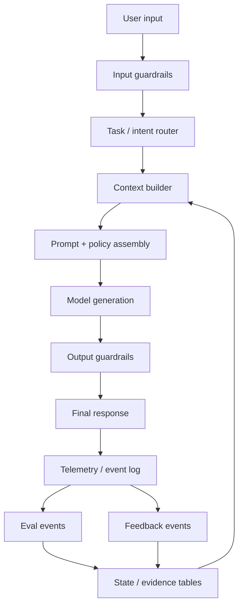
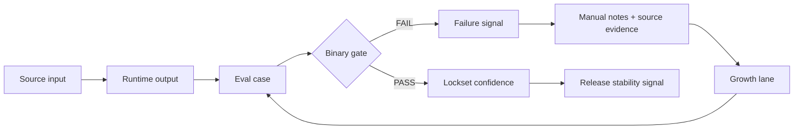
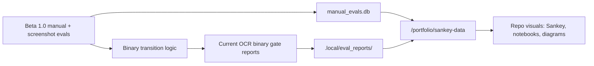

<!-- @format -->

# Diagrams

This page collects repo-native diagrams and notebook pointers. Canonical
runtime and eval contracts remain in `docs/runtime/ARCHITECTURE.md` and
`docs/eval/README.md`.

## Baseline LLM Product Pipeline

## Polinko Binary Eval Loop

## Beta Evidence Map

## Notebook

- Tracked starter notebook:
  `output/jupyter-notebook/ocr-eval-live-filters-starter.ipynb`
- Local/private notebook outputs should stay untracked unless explicitly
  promoted as curated public evidence.
