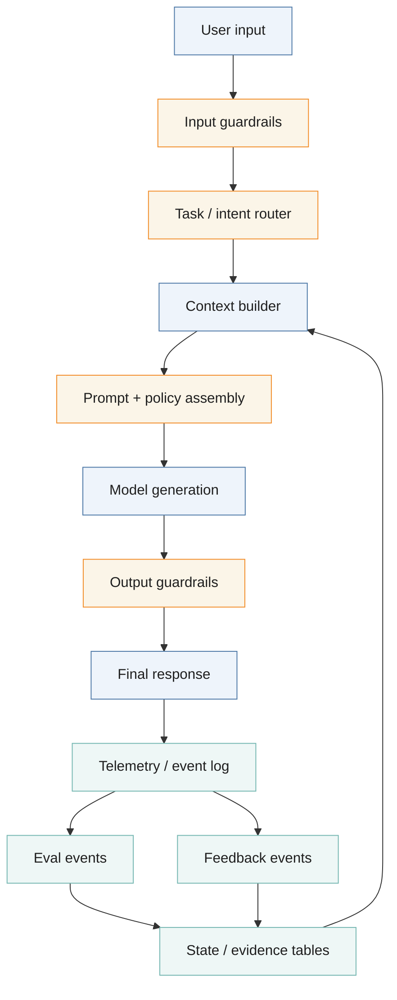
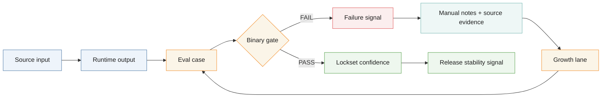
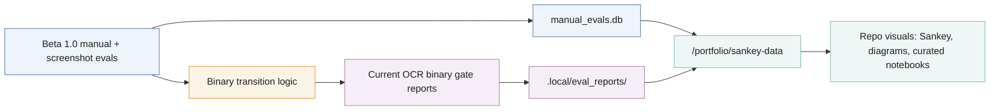

<!-- @format -->

# Diagrams

This page collects repo-native diagrams and visual evidence pointers. Canonical
runtime and eval contracts remain in `docs/runtime/ARCHITECTURE.md` and
`docs/eval/README.md`.

Static SVG exports generated from this page:

- [Polinko Evidence Sankey (D3)](diagrams/polinko-evidence-sankey.svg)
- [Baseline LLM Product Pipeline](diagrams/baseline-llm-product-pipeline.svg)
- [Polinko Binary Eval Loop](diagrams/polinko-binary-eval-loop.svg)
- [Beta Evidence Map](diagrams/beta-evidence-map.svg)

Current dated progress note:

- [OCR Progress Snapshot (2026-05-01)](../research/ocr-progress-20260501.md)

## Polinko Evidence Sankey (D3)

Static D3 Sankey generated from the real `/portfolio/sankey-data` payload. It
shows how Beta 1.0 manual evals flow through manual outcomes and signal
classes into the current OCR lane weighting surface.

## Baseline LLM Product Pipeline

## Polinko Binary Eval Loop

## Beta Evidence Map

## Notebook

- Notebook experiments and query outputs stay local-only under ignored output
  lanes by default.
- Promote only curated, non-private notebook outputs into public docs.
