<!-- @format -->

# Diagrams

This page collects the main repo-native diagrams. Start with the eval contract
and current beta boundary, then use the lane-specific and continuity diagrams
below.

Static SVG exports generated from this page:

- [Polinko Eval Contract](diagrams/polinko-eval-contract.svg)
- [Polinko Post-Fail Gate Stack](diagrams/polinko-post-fail-gate-stack.svg)
- [OCR Progress Funnel](diagrams/ocr-progress-funnel.svg)
- [Current OCR Signal Shape](diagrams/current-ocr-signal-shape.svg)
- [Operator Burden Signal Shape](diagrams/operator-burden-signal-shape.svg)
- [Polinko Evidence Sankey (D3)](diagrams/polinko-evidence-sankey.svg)
- [Polinko Binary Eval Loop](diagrams/polinko-binary-eval-loop.svg)
- [Beta Evidence Map](diagrams/beta-evidence-map.svg)

Current dated progress note:

- [Beta 2.3 Snapshot (2026-05-16)](../research/beta_2_3_2026-05-16.md)
- [Co-Reasoning Promotion Snapshot (2026-05-08)](../research/co-reasoning-promotion-2026-05-08.md)
- [Operator Burden Signal Shape (2026-05-12)](../research/operator-burden-signal-shape-2026-05-12.md)
- [OCR Progress Snapshot (2026-05-08)](../research/ocr-progress-2026-05-08.md)
- [Prior OCR Progress Snapshot (2026-05-01)](../research/ocr-progress-2026-05-01.md)

## Polinko Eval Contract


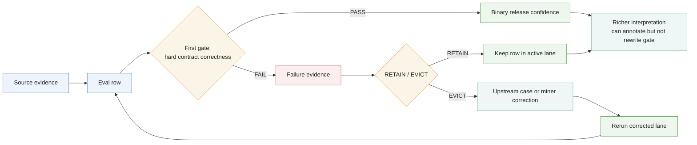

## Polinko Post-Fail Gate Stack


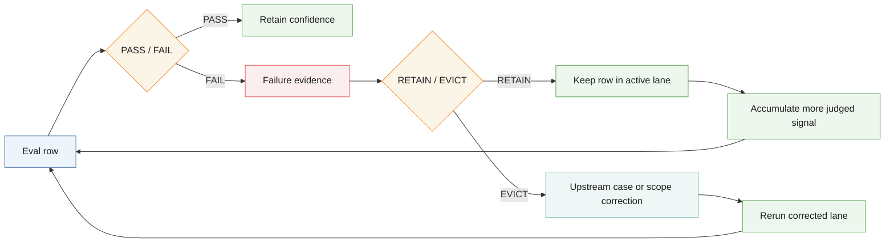

## OCR Progress Funnel


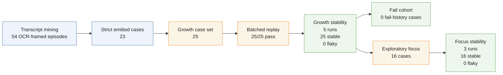

## Current OCR Signal Shape


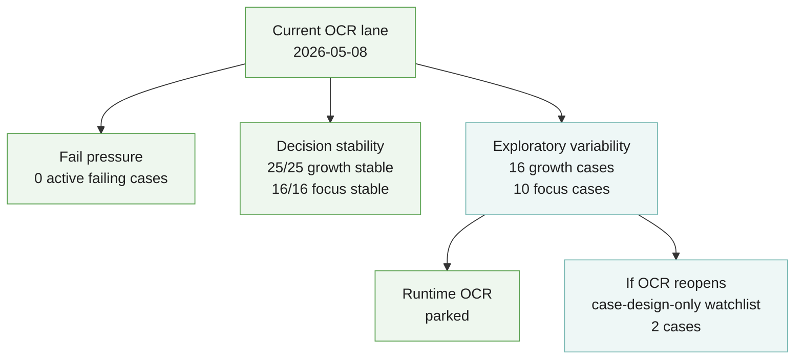

## Operator Burden Signal Shape


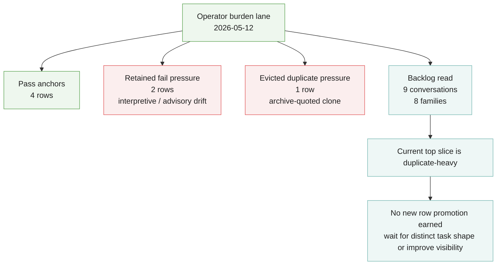

## Polinko Evidence Sankey (D3)

Static D3 Sankey generated from the real `/portfolio/sankey-data` payload. It
shows how Beta 1.0 manual evals flow through manual outcomes and signal
classes into the current OCR lane weighting surface.

## Polinko Binary Eval Loop


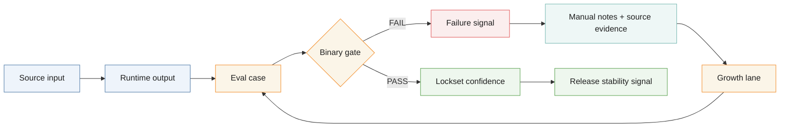

## Beta Evidence Map


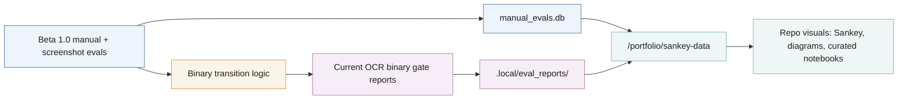

## Reference Note

The older baseline product-pipeline diagram is no longer a primary public
surface. It was useful as category framing, but the current OCR diagrams are
the more meaningful front-door visual signal.

## Notebook

- Notebook experiments and query outputs stay local-only under ignored output
  lanes by default.
- Promote only curated, non-private notebook outputs into public docs.
