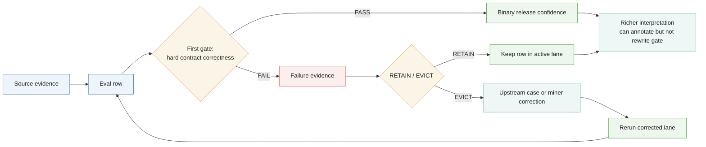
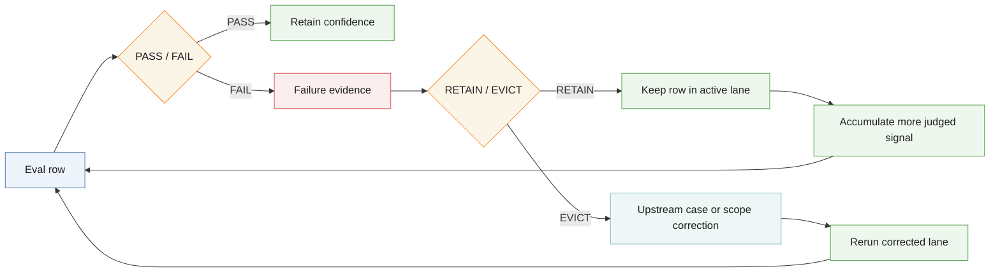
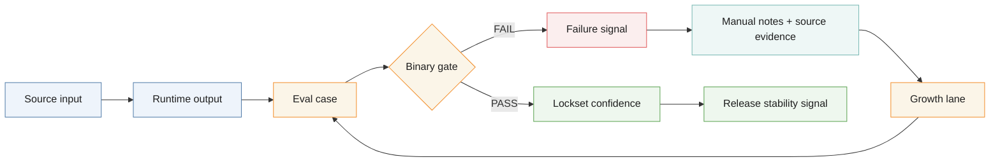

<!-- @format -->

# Eval Contract Diagrams

These diagrams describe Polinko’s binary eval contract and the post-fail
evidence loop.

## Polinko Eval Contract

## Polinko Post-Fail Gate Stack

## Polinko Binary Eval Loop

