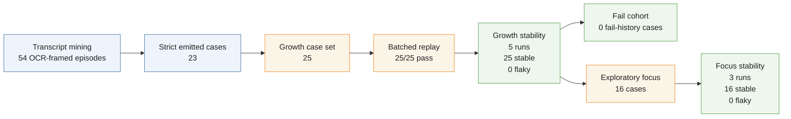
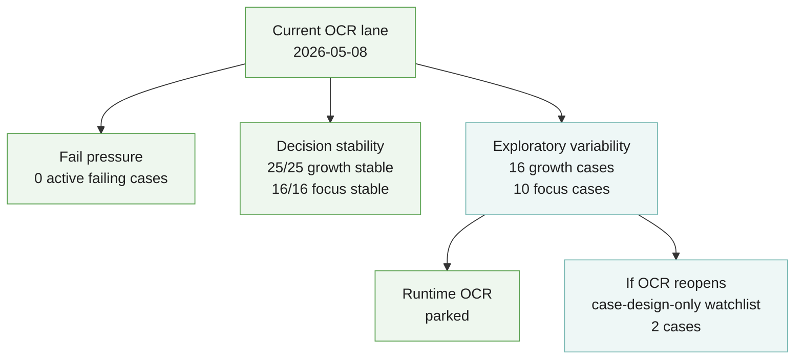
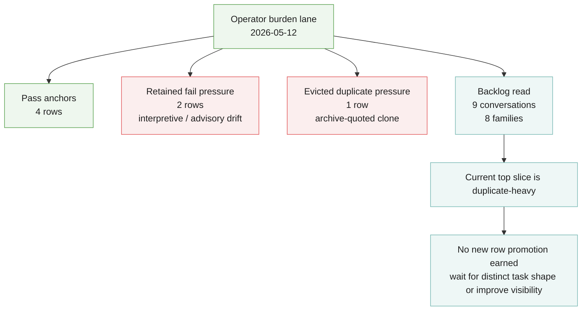
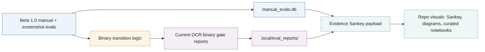

<!-- @format -->

# Evidence And OCR Diagrams

These diagrams collect the current OCR signal shape, operator-burden signal, and
tracked evidence-map surfaces.

## OCR Progress Funnel

## Current OCR Signal Shape

## Operator Burden Signal Shape

## Polinko Evidence Sankey

Static D3 Sankey generated from tracked eval evidence. It shows how Beta 1.0
manual evals flow through manual outcomes and signal classes into the current
OCR lane weighting surface.

## Beta Evidence Map

