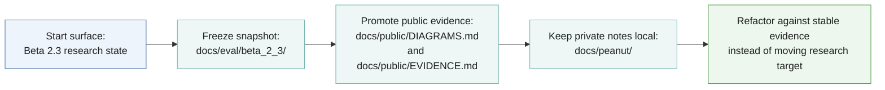
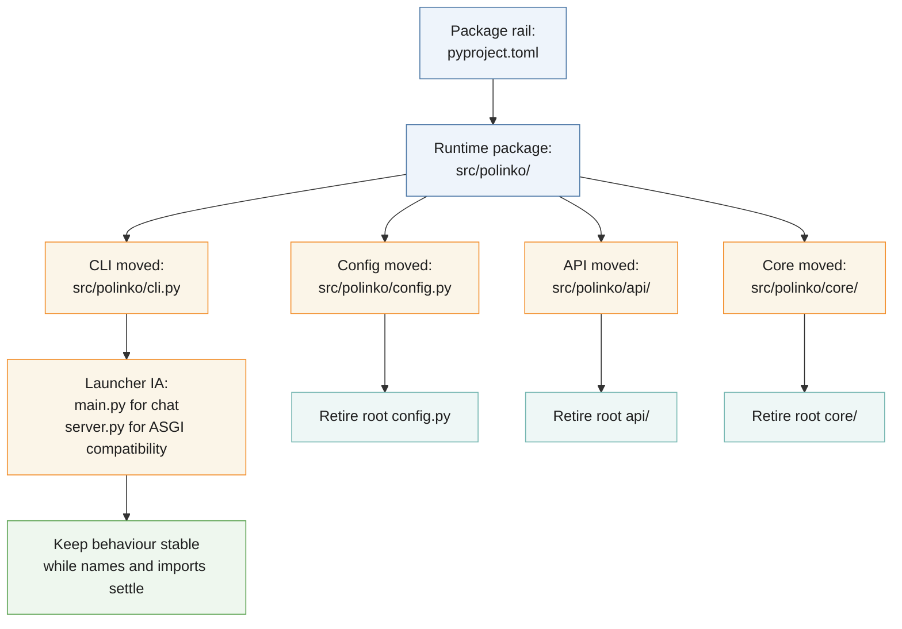
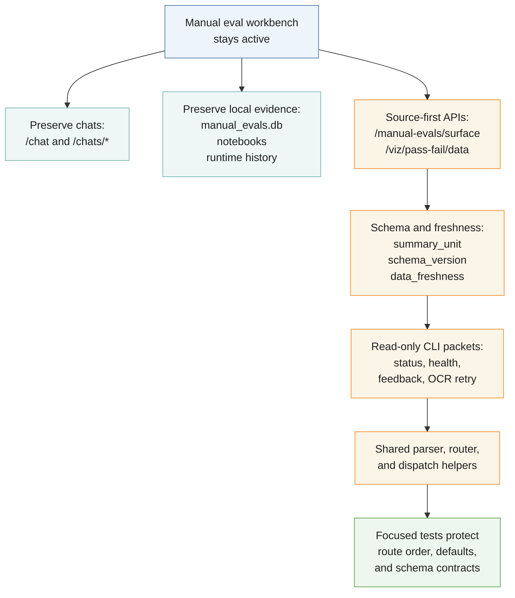
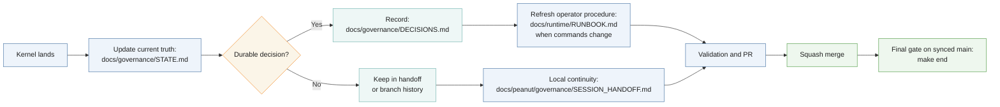

<!-- @format -->

# Refactor Journey Diagrams

These diagrams show the refactor journey by lane: first evidence baseline,
runtime/package movement, manual-eval workbench preservation, and docs/closeout
propagation.

## Refactor Journey: Evidence First

## Refactor Journey: Runtime Package Boundary

## Refactor Journey: Manual Eval Workbench

## Refactor Journey: Docs And Closeout

