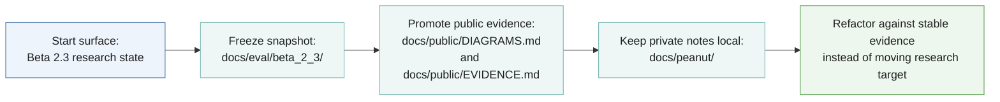
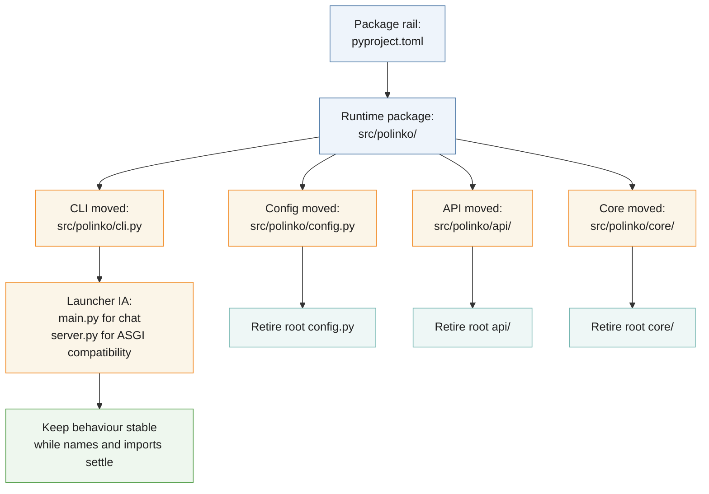
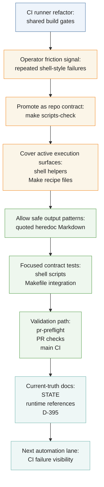
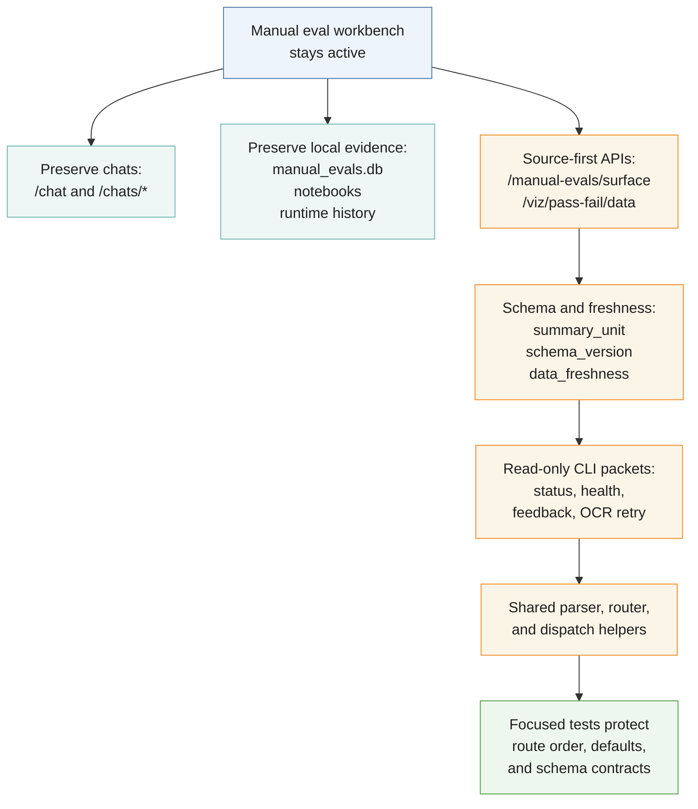
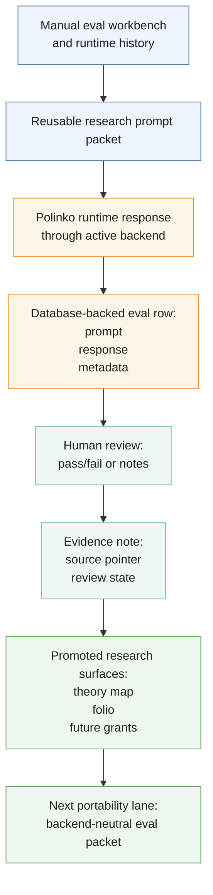
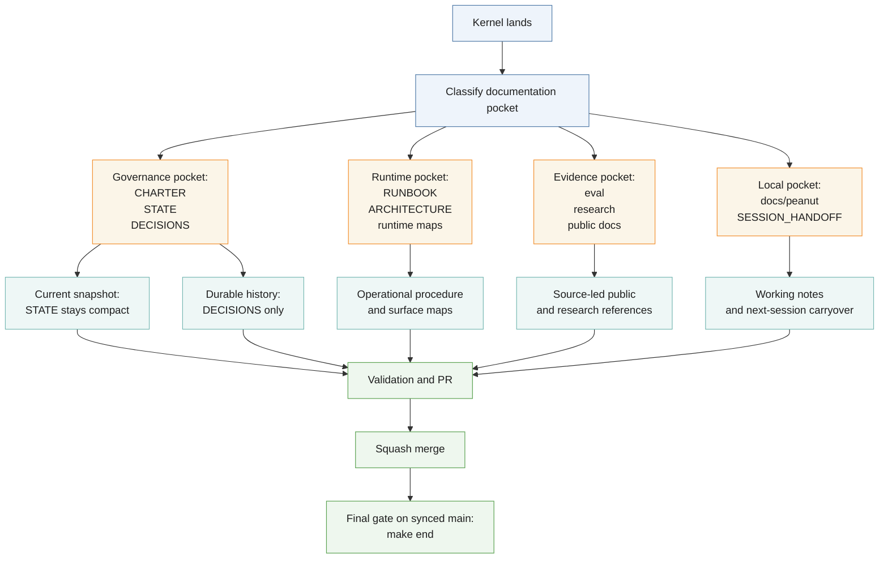

<!-- @format -->

# Refactor Journey Diagrams

These diagrams show the refactor journey by lane: first evidence baseline,
runtime/package movement, automation-backed contracts, manual-eval workbench
preservation, logged research-prompt evals, and documentation pocket routing.

## Refactor Journey: Evidence First

## Refactor Journey: Runtime Package Boundary

## Refactor Journey: Automation-Backed Contracts

## Refactor Journey: Manual Eval Workbench

## Refactor Journey: Logged Research-Prompt Eval Bridge

## Refactor Journey: Documentation Pockets

