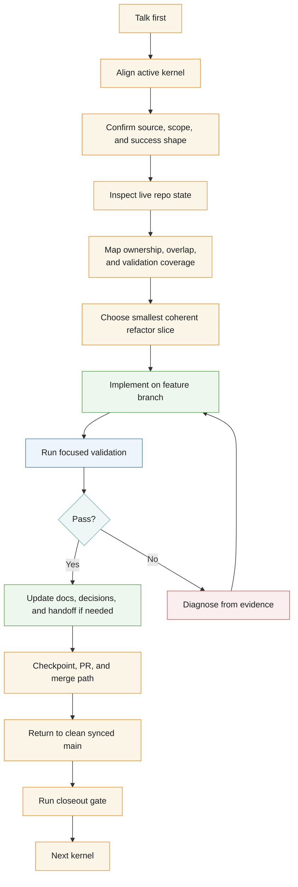
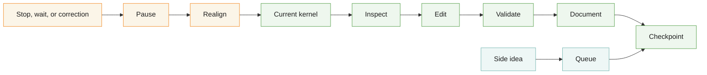
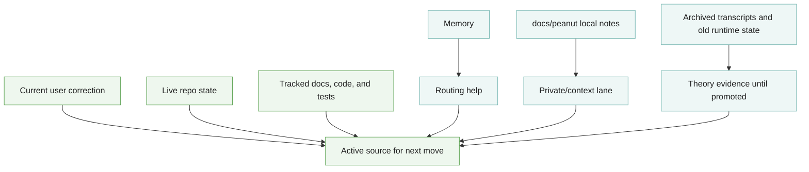
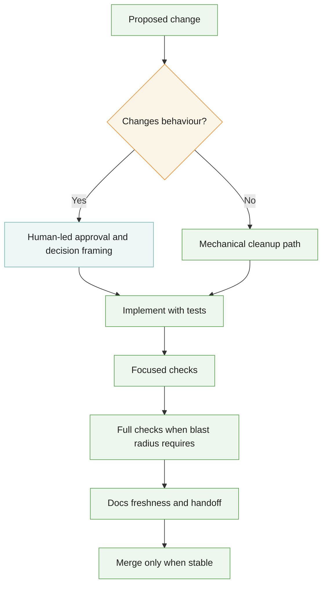
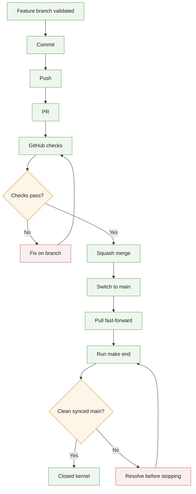

<!-- @format -->

# Refactor Method Diagrams

These diagrams describe the working method used during the current Polinko
refactor.

## Refactor Operating Loop

## One Kernel Rule

## Refactor Source Hierarchy

## Refactor Safety Gate

## Clean Main Closeout

