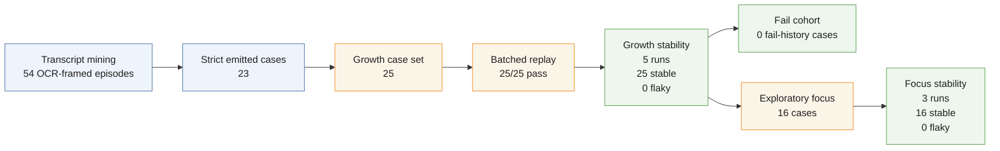
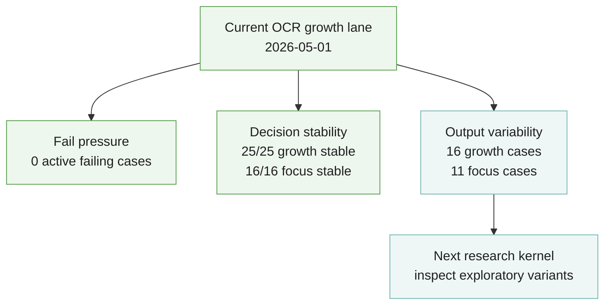

<!-- @format -->

# OCR Progress Snapshot

- Run date: `2026-05-01`
- Kernel: `make ocrkernel CGPT_EXPORT_ROOT=/abs/path/to/CGPT-DATA-EXPORT`
- Lane: `ocr_growth`
- Local report artifacts:
  - `.local/eval_cases/ocr_transcript_cases_delta.md`
  - `.local/eval_reports/ocr_growth_batched_summary.md`
  - `.local/eval_reports/ocr_growth_stability.json`
  - `.local/eval_reports/ocr_growth_metrics.md`
  - `.local/eval_reports/ocr_growth_fail_cohort.md`
  - `.local/eval_reports/ocr_focus_stability.json`
  - `.local/eval_reports/ocr_focus_fail_patterns.md`

## Summary

- Transcript OCR episodes: `54`
- Emitted strict cases: `23`
- Growth cases: `25`
- Growth batch replay: `25/25` pass
- Growth stability: `5/5` runs, `25` stable, `0` flaky
- Growth focus stability: `3/3` runs, `16` stable, `0` flaky
- Active fail cohort cases: `0`
- Focus fail patterns: `0/16` failing

## Progress Funnel

## Current Signal Shape

## Most Useful Signal

This kernel did not surface a new failing OCR cohort. The current signal is
clean on strict pass/fail and clean on replay stability. The remaining live OCR
research signal is exploratory output variability, not failing or flaky cases.

That matters because it changes the next move. The next OCR kernel is not
another generator fix. It is a review of the exploratory cases whose output
varies while still passing the current binary gate.
