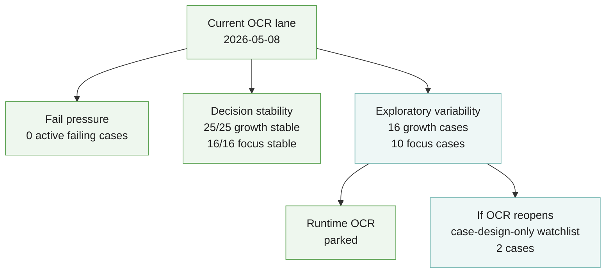

<!-- @format -->

# OCR Progress Snapshot

- Run date: `2026-05-08`
- Kernel: exploratory OCR variability follow-up
- Lane: `ocr_focus`
- Source transition:
  - starting state came from the `2026-05-01` full OCR kernel
  - follow-up narrowed exploratory phrase probes and evaluator phrase matching
  - result was judged through fresh focus replay and focus stability only
- Local report artifacts:
  - `.local/eval_reports/ocr_focus_stability.json`
  - `.local/eval_reports/ocr_focus_fail_patterns.md`
  - `.local/eval_cases/ocr_growth_focus_cases.json`

## Summary

- Growth stability remains: `25/25` stable, `0` flaky
- Focus stability remains: `16/16` stable across `3/3` runs
- Active fail cohort cases: `0`
- Focus fail patterns: `0/16` failing
- Focus output-variant cases: `10`
- Runtime OCR follow-up state: parked

## Current Signal Shape

## What Changed

- Two former focus-watchlist cases are now fully stable:
  - `gx-693c53e4-013`
  - `gx-6952d743-019`
- The exploratory seam is cleaner:
  - focus overrides now prefer supported literal multi-token review phrases
  - evaluator phrase checks now survive OCR token breaks and punctuation gaps
- The remaining focus variability is lower-pressure than before:
  - one decorative/layout-only case
  - one repeated heading/markup family
  - a stable-cue lexical-noise group
  - two remaining case-design watch candidates

## Remaining Watchlist

If OCR follow-up reopens, it should not start from transport, retries, or
binary gate changes. It should start from case design only:

- `gx-68844003-002`
- `gx-6952d743-021`

## Most Useful Signal

The important change is not a new failing cohort. It is a boundary change.

- runtime OCR hardening did its job
- the remaining pressure is no longer in OCR execution behavior
- the remaining pressure is in case semantics and guarded cue design

That means the correct next move after this note is to keep OCR runtime parked
until case-design pressure or new fail pressure earns another follow-up.
