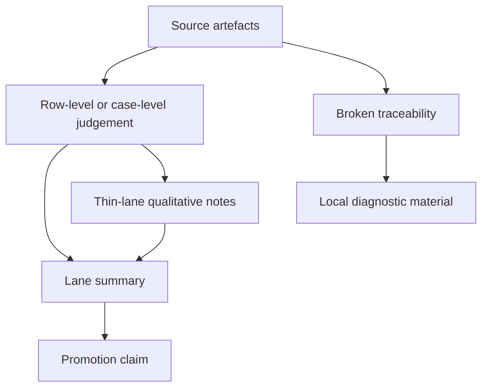

<!-- @format -->

# Pre-Beta 2.4 Research Model Contract

Date: `2026-05-19`

Status: `staged`

## Boundary

`Beta 2.3` is the frozen baseline. Its eval snapshot lives under
`docs/eval/beta_2_3/` and remains the source for the current method read.

`pre-Beta 2.4` names the next research-model contract before new evidence is
cut. The first evidence folder is cut when real evidence exists.

Historical method evidence stays in its dated research note and Decisions. The
staged contract is source-first.

The active question is whether Polinko can move from lane snapshots to
source-first research claims while preserving row evidence and the manual eval
workbench as source material.

## Diagram

## Contract

- OCR remains case-level `pass` / `fail` under broader generalisation pressure.
- OCR post-fail handling can still use `retain` / `evict` case governance.
- Non-OCR lanes stay source-first:
  - manual eval judgement
  - manual eval workbench evidence from notebooks, local evidence databases,
    and chat artefacts
  - row-local or case-local `pass` / `fail` where binary judgement is earned
  - qualitative notes where the lane is still thin
- Canonical pre-Beta 2.4 claims stay source-first and row/case-bound.
- Any promotion claim must stay traceable to source artefacts, row/case
  judgement, and repeated lane signal.

## Evidence Stack

The research model has four layers:

1. Source artefacts from active workbench and eval surfaces.
2. Row-level or case-level judgements that preserve source evidence.
3. Lane-level summaries with visible counts, examples, and exclusions.
4. Promotion claim only after repeated lane signal stabilises.

Canonical source surfaces include:

- notebooks launched by `make notes`, `make notebook`, and `make nb`
- `POST /chat`
- `/chats/*`
- `.local/runtime_dbs/active/manual_evals.db`
- `.local/runtime_dbs/active/history.db`
- tracked eval reports and research notes under `docs/eval/` and
  `docs/research/`

The staged contract sits above these sources, keeps them canonical, preserves
manual eval row evidence, and keeps thin lanes staged before hard gates are
promoted.

## First Kernel Shape

The first pre-Beta 2.4 kernel should be small, predetermined, and auditable.

It should record:

- source artefacts used
- row or case count
- manual-eval or chat-workbench evidence
- explicit exclusions with narrow reasons
- lane summary before any method claim

A new `docs/eval/beta_2_4/` evidence folder should be cut when real evidence
exists.

## Decision Rule

A pre-Beta 2.4 kernel can inform the next beta only when the evidence stack
stays traceable from source artefact to row/case judgement to lane summary. If
that chain breaks, the result remains local diagnostic material rather than
promoted beta evidence.
