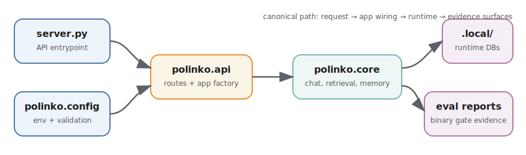

# Architecture

This page is the fast structural map of the repo: start here when you need to
trace how runtime wiring, data surfaces, and eval evidence fit together.

## Top-Level Map

- `app.py`
  - CLI chat entrypoint.
- `server.py`
  - FastAPI API entrypoint (`create_app(...)`).
- `config.py`
  - Environment loading + validation.
- `api/`
  - HTTP layer, route spec, middleware, auth/rate-limit integration.
- `core/`
  - Runtime logic (prompting, session/history, personalization, retrieval helpers).
- `tools/`
  - Local automation/eval/reference utilities.
- `tests/`
  - API/runtime regression tests.
- `docs/`
  - Charter, state, decisions, runbook, handoff, operator references, and
    eval lane references.

## Runtime Flow

1. `server.py` loads config from `config.py`.
2. `server.py` calls `api.app_factory.create_app(config)`.
3. `api/app_factory.py` wires routes + middleware + runtime dependencies.
4. Request execution delegates to `core/` runtime and persistence modules.
5. `POST /chat` supports harness override (`harness_mode=fixture`) for
   deterministic smoke without model calls; default remains `live`.
6. CLI/API surfaces remain canonical; beta transition evidence is maintained
   under `docs/eval/` and mapped in `docs/eval/README.md`.
7. OCR-forward quality loop is the active reliability engine:
   - transcript case miner builds local OCR case sets
   - lockset lane gates release quality (strict binary pass/fail)
   - growth lane captures fail-heavy novel cases for pass-from-fail tracking

## Data Surfaces

- Runtime chat/session state:
  - SQLite stores (chat history + memory/vector artifacts).
  - Runtime DBs live under `.local/runtime_dbs/active/`; archives under
    `.local/runtime_dbs/archive/`.
- Eval runtime state (raw source):
  - `.local/runtime_dbs/active/history.db` via `core/history_store.py`
    - `message_feedback` (binary `pass`/`fail` + tags/notes/status)
    - `eval_checkpoints` (`pass_count`, `fail_count`, `non_binary_count`)
    - `ocr_runs` raw OCR history imported into `manual_evals.db` and available
      as fallback/manual-eval lane context
  - active gate logic is binary-only (`pass`/`fail`); `non_binary_count` is an
    integrity signal only.
  - checkpoint API responses include explicit fail-closed `gate_outcome`
    (`pass`/`fail`) derived from counts.
  - canonical policy/gate/ui specs are maintained in `docs/runtime/RUNBOOK.md`.
- Canonical eval warehouse:
  - `.local/runtime_dbs/active/manual_evals.db`
    - rebuilt by `make manual-evals-db`
    - imports current `history.db` plus optional Beta 1.0 history from
      `.local/legacy_eval/archive_legacy_eval/databases/.polinko_history.db`
    - stores integrated rows with explicit `era`, source DB, source session,
      and source run provenance
  - this is the single app-facing eval database for integrated manual-eval
    analysis and manual-eval UI work; raw history files are import sources, not
    separate eval truths.
- Eval visualization surfaces:
  - `.local/eval_reports/`
    - primary source for `/viz/pass-fail` and `/viz/pass-fail/data`
    - OCR binary gate reports feed bucketed strict `fail` / `pass` stacks
    - latest detail rows are sorted FAIL-first so failure pressure is visible
    - report timestamps/run IDs drive ordering; filesystem copy/restore times
      must not define the research window
  - `.local/runtime_dbs/active/manual_evals.db`
    - canonical integrated manual-eval warehouse
    - explicit/fallback data source for manual feedback and OCR lane context
    - Beta 1.0/current provenance remains visible through `era` and source
      columns
  - design intent:
    - local-only, visual-forward, near-real-time surface
    - fail-signal instrument rather than pass-rate vanity dashboard
    - insight-first summary rather than dense dashboard analysis
- Portfolio evidence surface:
  - `GET /portfolio/sankey-data`
    - combines Beta 1.0 manual feedback from
      `.local/runtime_dbs/active/manual_evals.db` with current OCR binary gate
      reports from `.local/eval_reports/`
    - returns `source_integrity=real_data_only`
    - returns `available=false` and empty graphs when either source is missing;
      it must not fabricate decorative fallback links
    - bridge links are source-side counts through an evidence-continuity anchor,
      not row-level joins between legacy and current datasets
  - `GET /portfolio`
    - serves local `ui/index.html` when present, otherwise serves the tracked
      in-app about/contact fallback
    - `frontend/` and `ui/` are local-only working directories, ignored except
      tracked `.gitkeep` placeholders
    - public website scope is a lean doorway into the repo, not a recreation of
      the research system
    - evidence visuals remain repo research instruments
    - static SVG/D3 evidence views remain the preferred fallback when those
      visuals are surfaced
    - no-data behavior must stay visible in any evidence surface that consumes
      `GET /portfolio/sankey-data`
    - the former pinned-stage/FPO frontend is archived design context unless
      deliberately restored on a new branch
- Eval artefacts:
  - Git history is the canonical retention mechanism for tracked project state.
  - local eval artefacts are operational outputs (default under `eval_reports/`).
  - local OCR binary gate reports are authoritative observability evidence for
    the pass/fail visualization, but they do not mutate runtime gate policy.
  - no file-log-driven eval wiring exists in runtime gate decisions.
  - beta transition evidence is reference-only for active runtime gates:
    - `docs/eval/beta_1_0/` records binary-transition evidence
    - `docs/eval/beta_2_0/` records binary-operational evidence
    - neither path can drive active gate decisions directly
- OCR eval lanes (active):
  - lockset gate: stable benchmark subset that must stay green
  - growth lane: exploratory/novel subset where failures are expected signal
  - local case/report surfaces (untracked):
    - `.local/eval_cases/`
      - includes widened growth set:
        `.local/eval_cases/ocr_transcript_cases_growth.json`
      - includes growth fail cohort:
        `.local/eval_cases/ocr_growth_fail_cohort.json`
    - `.local/eval_reports/`
      - includes growth stability:
        `.local/eval_reports/ocr_growth_stability.json`
    - growth metrics:
      - `.local/eval_reports/ocr_growth_metrics.json`
      - `.local/eval_reports/ocr_growth_metrics.md`
    - growth fail cohort report:
      - `.local/eval_reports/ocr_growth_fail_cohort.md`
  - local notebook/query exploration:
    - `output/jupyter-notebook/` (ignored local output lane)

## Placement Rules

- API endpoints/middleware/specs: `api/`
- Prompt/runtime behaviour and policy logic: `core/`
- Eval/report/reference scripts and one-off operators: `tools/`
- Execution state/decisions/handoff documentation: `docs/`
- Historical beta transition references: `docs/eval/README.md`

## Governance Flow

- Collaboration/execution policy is anchored in `docs/governance/CHARTER.md`.
- Co-reasoning control rights are human-led for objective/scope/acceptance and
  go/no-go decisions.
- Durable process, engineering/tooling, runtime/API, dependency/workflow, and
  eval-governance decisions are appended in
  `docs/governance/DECISIONS.md`.
- Operator procedure lives in `docs/runtime/RUNBOOK.md`.
- Current-state checkpoints live in `docs/governance/STATE.md` and are
  refreshed in place.
- Next-session carryover constraints live in
  `docs/governance/SESSION_HANDOFF.md` and are refreshed in place.
- Visual exploration, theory, transcripts, and human-facing working notes stay
  in the local-only `docs/peanut/` lane.
- Policy updates are complete only when all relevant surfaces above are aligned.

## Operational Commands

- Env sanity: `make doctor-env`
- Backend tests: `make test`
- Local API: `make server` or `make server-daemon`
- Wiring spec: `docs/runtime/RUNBOOK.md`
- Runtime DB lifecycle commands are retired during wiring lock
  (see `docs/runtime/RUNBOOK.md`).
- Local eval trace backfill (optional): `make backfill-eval-traces`
- Growth-lane metrics report: `make ocrgrowth`
- Growth-lane fail cohort materialisation: `make ocrfails`
  - selection is constrained to growth-lane cases that map to OCR-framed
    transcript review episodes (`ocr_framing_signal=true`)
