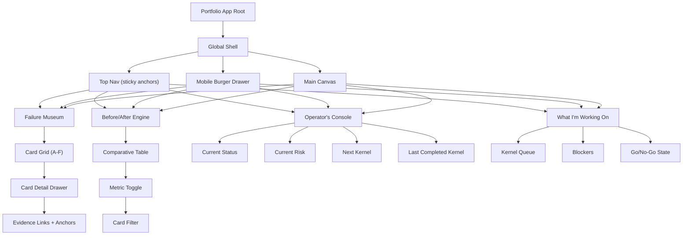

# Portfolio UI IA + Wireframe (v1)

## Objective

Define the first implementation-ready information architecture and low-fidelity
wireframe for the portfolio surface, aligned to the locked narrative order:

1. `Operator's Console`
2. `Failure Museum`
3. `Before/After Engine`
4. `What I'm Working On`

Navigation lock for this version:

- Desktop: sticky top navigation (anchor-based)
- Mobile: burger drawer with the same anchors
- Hi-fi shell exploration is deferred; this spec is IA + low-fi only

Transformation-stage naming contract:

- UI/public labels:
  1. `Baseline`
  2. `Bridge (Polinko Beta 1.0)`
  3. `Polinko Beta 2.0`
- Technical/repo language:
  - treat `Baseline` as the experimental `Control` in method/evidence notes.

## IA chart



## Screen structure

### Desktop wireframe

```text
+----------------------------------------------------------------------------------+
| TOP NAV (sticky): Console | Museum | Before/After | Working On                  |
+----------------------------------------------------------------------------------+
| HERO BAND (optional shell header; no heavy controls in v1)                       |
+----------------------------------------------------------------------------------+
| MAIN CANVAS                                                                        |
| [Section header + section controls]                                                |
| [Primary section content]                                                          |
| [Detail drawer / evidence panel (contextual)]                                      |
+----------------------------------------------------------------------------------+
```

### Mobile wireframe

```text
+--------------------------------------------------+
| TOP BAR (compact)                                |
+--------------------------------------------------+
| BURGER MENU -> Console | Museum | Before/After | WIP |
+--------------------------------------------------+
| SECTION BODY                                      |
| [single-column content]                           |
| [card tap -> full-screen detail]                  |
+--------------------------------------------------+
```

## Section contracts

### 1) Operator's Console

- Must show:
  - current status
  - current risk
  - next kernel
  - last completed kernel
- Optional:
  - snapshot id/tag badge
  - confidence indicator (text only, no score theatrics)

### 2) Failure Museum

- Card grid (A-F) with compact preview:
  - claim
  - observed failure
  - before -> after metric
- Card click opens detail drawer:
  - intervention
  - stress test
  - decision
  - evidence anchors

### 3) Before/After Engine

- Table-first (v0):
  - card
  - before state
  - after state
  - metric delta
  - decision impact
- Controls:
  - filter by card
  - filter by metric theme
- Conclusion morph (required):
  - include a replayable transformation sequence:
    - `Baseline` -> `Bridge (Polinko Beta 1.0)` -> `Polinko Beta 2.0`
  - anchor the morph to 3-4 explicit deltas:
    - gate density/shape
    - fail handling discipline
    - uncertainty handling posture
    - release gate strictness
  - keep this as evidence-linked motion, not decorative animation.

### 4) What I'm Working On

- Live queue:
  - in-progress kernels
  - blockers
  - explicit go/no-go line
- Human-AI interaction snapshots (optional strip):
  - compact captioned snapshots from:
    - `docs/peanut/assets/screenshots/human-ai-interaction/`
  - purpose is tone/authorship evidence, not primary technical proof.
  - each snapshot requires:
    - one-line caption
    - evidence anchor/path

## Data model (UI-facing)

```json
{
  "snapshot": {
    "tag": "portfolio-nucleus-v1-2026-04-07",
    "commit": "da4ba66846dde5dd88062dc741ca635661975e2e"
  },
  "operator_console": {
    "status": "string",
    "risk": "string",
    "next_kernel": "string",
    "last_completed_kernel": "string"
  },
  "failure_museum": [
    {
      "card_id": "A-F",
      "claim": "string",
      "observed_failure": "string",
      "intervention": "string",
      "before_metric": "string",
      "after_metric": "string",
      "stress_test": "string",
      "decision": "string",
      "anchors": {
        "transcript": ["path:line"],
        "decision": ["path:line"],
        "eval": ["path:line"]
      }
    }
  ],
  "before_after_rows": [
    {
      "card_id": "A-F",
      "before_state": "string",
      "after_state": "string",
      "metric_delta": "string",
      "decision_impact": "string",
      "evidence_anchor": "path"
    }
  ],
  "conclusion_morph": {
    "stages": ["Baseline", "Bridge (Polinko Beta 1.0)", "Polinko Beta 2.0"],
    "delta_callouts": [
      "gate_density_shape",
      "fail_handling_discipline",
      "uncertainty_handling_posture",
      "release_gate_strictness"
    ],
    "replay_enabled": true
  },
  "work_queue": {
    "queue": ["string"],
    "blockers": ["string"],
    "go_no_go": "GO|NO-GO",
    "interaction_snapshots": [
      {
        "image_path": "docs/peanut/assets/screenshots/human-ai-interaction/<file>",
        "caption": "string",
        "evidence_anchor": "path:line"
      }
    ]
  },
  "method_language": {
    "ui_label": "Baseline",
    "repo_label": "Control"
  }
}
```

## Visual direction (v0)

- Minimal, high-contrast, low-clutter.
- One strong top navigation layer, one content canvas.
- Evidence never more than one click away.
- Motion only for section transitions and drawer open/close.

## Build sequencing

1. Implement shell + nav + routing.
2. Render static JSON fixtures (no live adapters yet).
3. Add card drawer interactions and anchor links.
4. Add comparative table controls.
5. Add style polish and lightweight transitions.

## Acceptance criteria (v0)

- IA order matches locked structure exactly.
- All 4 sections render from a single JSON source.
- Failure Museum cards open with full detail and anchor links.
- Before/After table filters by card without page reload.
- Mobile layout preserves the same content order and meaning.
