<!-- @format -->

# Runtime Surface Map

Last updated: 2026-06-23

This map shows the local runtime and operator surfaces that need to stay
maintainable during the current refactor. It separates manual startup,
human-led closeout, CI, background runners, and eval/workbench tooling so each
cleanup kernel can stay scoped.

```mermaid
flowchart TD
  subgraph Startup["Startup and alignment"]
    VSCode["VS Code manual task"] --> MakeStart["make start"]
    Operator["chat-led startup"] --> MakeStart
    MakeStart --> StartRoutine["tools/start_of_day_routine.sh"]
    StartRoutine --> RepoRoot["tools/repo_root.sh"]
    StartRoutine --> Doctor["make doctor-env"]
    StartRoutine --> WakeLock["make caffeinate + caffeinate-status"]
    StartRoutine --> ApiSmoke["make api-smoke"]
    ApiSmoke --> SmokeServer["temporary uvicorn server"]
    ApiSmoke --> SmokeDbs["isolated smoke SQLite paths"]
    StartRoutine --> Rehydrate["rehydrate prompt + alignment pause"]
  end

  subgraph Closeout["Active validation and session closeout"]
    EndPreflight["make end-preflight"] --> BranchChecks["branch-local validation"]
    SessionCloseout["session closeout"] --> MainSync["clean synced main"]
    MainSync --> MakeEnd["make end"]
    MakeEnd --> RepoRoot
    MakeEnd --> DocsGate["make end-docs-check"]
    MakeEnd --> ScriptGate["make scripts-check"]
    MakeEnd --> PathLeakGate["make path-leak-check"]
    MakeEnd --> RiskScan["make risk-scan"]
    MakeEnd --> TestGate["style, type, docs, package, tests"]
    MakeEnd --> SecurityGate["make security-checks"]
    MakeEnd --> EndStop["make end-stop"]
    EndStop --> SessionStatus["make session-status"]
    MakeEnd --> GitGate["make end-git-check"]
  end

  subgraph Runners["Background runner family"]
    ServerDaemon["server-daemon"]
    EvalSidecar["eval-sidecar"]
    PortfolioMockups["portfolio mockups"]
    ManagedCaffeinate["repo-managed caffeinate"]
    RunnerContract["shared PID, liveness, log, and cleanup pattern"]
    ServerDaemon --> RunnerContract
    EvalSidecar --> RunnerContract
    PortfolioMockups --> RunnerContract
    ManagedCaffeinate --> RunnerContract
  end

  subgraph Evals["Manual eval and OCR tooling"]
    ManualWorkbench["manual eval workbench"]
    DbHealth["manual_evals_db_health command"]
    OcrInventory["read-only OCR inventory"]
    AliasCheck["operator-alias-check"]
    FeedbackDrafts["local decision drafts and previews"]
    EvalAliases["Make eval aliases and wrappers"]
    OcrWrappers["OCR workflow wrappers"]
    SharedCaseGuard["shared OCR case guard"]
    ManualWorkbench --> DbHealth
    ManualWorkbench --> OcrInventory
    ManualWorkbench --> AliasCheck
    ManualWorkbench --> FeedbackDrafts
    DbHealth --> EvalAliases
    OcrInventory --> EvalAliases
    EvalAliases --> OcrWrappers
    OcrWrappers --> SharedCaseGuard
  end

  subgraph CI["CI and dependency automation"]
    GitHubActions["GitHub Actions"]
    Dependabot["Dependabot"]
    DependencyReview["dependency-review"]
    StartupContracts["startup-contracts-check"]
    AuditTools["pip-audit and npm audit"]
    GitHubActions --> StartupContracts
    GitHubActions --> DependencyReview
    GitHubActions --> AuditTools
    Dependabot --> GitHubActions
  end

  Rehydrate --> Closeout
  Rehydrate --> Runners
  Rehydrate --> Evals
  BranchChecks --> CI
```

## Reading the Map

- Startup should stay narrow and chat-led: it verifies environment health,
  starts the repo-managed wake lock, runs smoke checks with isolated defaults,
  and stops for alignment. VS Code keeps `make start` available as a manual
  task; folder-open bootstrap is retired.
- Active validation and session closeout are separate surfaces:
  `make end-preflight` is branch-local validation, while `make end` is the
  session closeout routine from clean synced `main`; `make eod` is a
  compatibility alias only. `make end-stop` is the current closeout helper for
  stopping background runners, then `make session-status` reports each runner
  family. `make risk-scan` verifies
  that known high-risk runtime, script, CI, and local configuration surfaces
  remain visible in the tracked map and Make gates.
  `make local-runtime-config-check` runs through `make ci-docs` so VS Code
  task/config drift and retired local doc references fail the normal
  docs/runtime gate.
  `make startup-contracts-check` keeps startup/runtime doc contracts in the
  local docs gate so wording drift fails before a PR-only CI run.
  Startup, closeout, devcontainer setup, local privacy guard, OCR workflow,
  and Playwright snapshot helpers resolve the checkout root through
  `tools/repo_root.sh`.
  `make path-leak-audit-local` is the focused companion for ignored local
  runtime config surfaces such as VS Code, devcontainer, and pre-commit files;
  it checks local path leaks and reuses `make local-runtime-config-check` for
  VS Code task/config shape plus devcontainer config token drift through
  `tools.check_local_runtime_config`.
  Devcontainer setup resolves the repo root before installing dependencies.
  `make privacy-local-on` installs the current machine-local handoff exclude
  pattern; tracked docs remain visible.
- Core background runners use one ownership pattern for PID files,
  stale-process handling, logs, cleanup commands, and detached launch
  behaviour across `caffeinate`, `server-daemon`, `eval-sidecar`, and
  `portfolio-mockups`. Detached child-process launch is centralized through
  `tools/launch_detached_process.py`; runner scripts retain ownership of
  their domain-specific liveness and adoption logic.
  `server-daemon` adopts matching local `uvicorn server:app` processes on
  start, reports matching servers without PID files on status, and stops
  matching servers during closeout recovery.
  `eval-sidecar` reports missing current-file drift on start/status and still
  stops the repo-managed PID during closeout.
  `portfolio-mockups` treats a reachable mockup URL without a PID file as a
  lifecycle state: matching local `http.server` processes are adopted, while
  unmanaged reachable ports fail loudly.
- Manual eval and OCR tooling remain active workbench surfaces, but eval runs
  stay separate from startup and read-only inventory commands. Health,
  feedback, overlay, OCR retry, and reclassification Make targets route through
  one manual eval health command entrypoint while preserving public target
  names and preview/apply boundaries. `make operator-alias-check` keeps
  `manual-evals-*` targets paired with their `manualdb-*` compatibility aliases
  and keeps parked OCR eval aliases out of automatic startup, closeout, and CI
  dependencies. Base, growth, focus, and transcript-lane OCR wrappers share the
  same case guard before launching eval runners.
- CI and dependency automation should mirror local gates closely enough that
  failed remote runs point to real fixes, not setup drift.
- Local URL targets remain print-first by default. Explicit system-browser
  launch paths route through `tools/open_local_url.sh` so `docs`, `viz`, and
  portfolio launch behavior share one audited helper.
