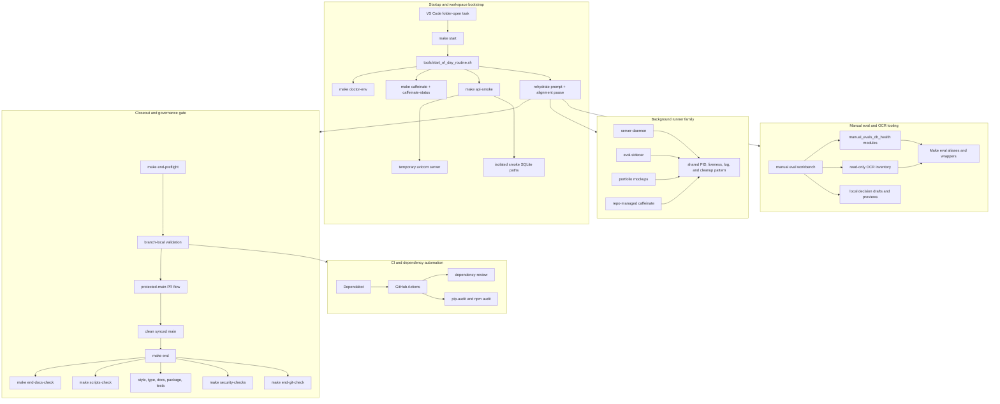

<!-- @format -->

# Runtime Surface Map

Last updated: 2026-06-19

This map shows the local runtime and operator surfaces that need to stay
maintainable during the current refactor. It separates automatic startup,
human-led closeout, CI, background runners, and eval/workbench tooling so each
cleanup kernel can stay scoped.

## Reading the Map

- Startup should stay narrow: it verifies environment health, starts the
  repo-managed wake lock, runs smoke checks with isolated defaults, and stops
  for alignment.
- Closeout is the complete stop-state contract: branch-local validation is
  preflight, but the final gate is `make end` from clean synced `main`.
- Background runners should converge on one ownership pattern for PID files,
  stale-process handling, logs, and cleanup commands.
- Manual eval and OCR tooling remain active workbench surfaces, but eval runs
  stay separate from startup and read-only inventory commands.
- CI and dependency automation should mirror local gates closely enough that
  failed remote runs point to real fixes, not setup drift.
