<!-- @format -->

# Runtime Surface Map

Last updated: 2026-06-29

This map shows the local runtime and operator surfaces that need to stay
maintainable during the current refactor. It separates manual startup,
human-led closeout, CI, background runners, and eval/workbench tooling so each
cleanup kernel can stay scoped.

```mermaid
flowchart TD
  subgraph Startup["Startup and alignment"]
    VSCode["VS Code manual task"] --> MakeStart["make start"]
    Operator["chat-led startup"] --> MakeStart
    MakeStart --> StartRoutine["tools/start_of_day_routine.sh"]
    StartRoutine --> RepoRoot["tools/repo_root.sh"]
    StartRoutine --> GitHubHealth["make github-health"]
    StartRoutine --> Doctor["make doctor-env"]
    StartRoutine --> WakeLock["make caffeinate + caffeinate-status"]
    StartRoutine --> ApiSmoke["make api-smoke"]
    ApiSmoke --> SmokeServer["temporary uvicorn server"]
    ApiSmoke --> SmokeDbs["isolated smoke SQLite paths"]
    StartRoutine --> Rehydrate["rehydrate prompt + alignment pause"]
  end

  subgraph Closeout["Active validation and session closeout"]
    EndPreflight["make end-preflight"] --> BranchChecks["branch-local validation"]
    SessionCloseout["session closeout"] --> MainSync["clean synced main"]
    MainSync --> MakeEnd["make end"]
    MakeEnd --> RepoRoot
    MakeEnd --> DocsGate["make end-docs-check"]
    MakeEnd --> ScriptGate["make scripts-check"]
    MakeEnd --> PathLeakGate["make path-leak-check"]
    MakeEnd --> RiskScan["make risk-scan"]
    MakeEnd --> TestGate["style, type, docs, package, tests"]
    MakeEnd --> SecurityGate["make security-checks"]
    MakeEnd --> EndStop["make end-stop"]
    EndStop --> SessionStatus["make session-status"]
    MakeEnd --> GitGate["make end-git-check"]
  end

  subgraph Runners["Background runner family"]
    ServerDaemon["server-daemon"]
    EvalSidecar["eval-sidecar"]
    ManagedCaffeinate["repo-managed caffeinate"]
    RunnerContract["shared PID, liveness, log, and cleanup pattern"]
    ServerDaemon --> RunnerContract
    EvalSidecar --> RunnerContract
    ManagedCaffeinate --> RunnerContract
  end

  subgraph Evals["Manual eval and OCR tooling"]
    ManualWorkbench["manual eval workbench"]
    DbHealth["manual_evals_db_health command"]
    OcrInventory["read-only OCR inventory"]
    CommandCheck["operator-command-check"]
    FeedbackDrafts["local decision drafts and previews"]
    EvalShortcuts["Make eval shortcuts and wrappers"]
    OcrWrappers["OCR workflow wrappers"]
    SharedCaseGuard["shared OCR case guard"]
    ManualWorkbench --> DbHealth
    ManualWorkbench --> OcrInventory
    ManualWorkbench --> CommandCheck
    ManualWorkbench --> FeedbackDrafts
    DbHealth --> EvalShortcuts
    OcrInventory --> EvalShortcuts
    EvalShortcuts --> OcrWrappers
    OcrWrappers --> SharedCaseGuard
  end

  subgraph CI["CI and dependency automation"]
    GitHubActions["GitHub Actions"]
    Dependabot["Dependabot"]
    DependencyReview["dependency-review"]
    GitHubHealth["make github-health"]
    StartupContracts["startup-contracts-check"]
    AuditTools["pip-audit and npm audit"]
    GitHubActions --> StartupContracts
    GitHubActions --> DependencyReview
    GitHubActions --> AuditTools
    Dependabot --> GitHubActions
    GitHubHealth --> GitHubActions
  end

  Rehydrate --> Closeout
  Rehydrate --> Runners
  Rehydrate --> Evals
  BranchChecks --> CI
```

## Reading the Map

- Startup should stay narrow and chat-led: it reports GitHub health attention,
  verifies environment health, starts the repo-managed wake lock, runs smoke
  checks with isolated defaults, and stops for alignment. VS Code keeps
  `make start` available as a manual task.
- Active validation and session closeout are separate surfaces:
  `make end-preflight` is branch-local validation, while `make end` is the
  session closeout routine from clean synced `main`. `make end-stop` is the
  current closeout helper for stopping background runners, then
  `make session-status` reports each runner family. `make risk-scan` verifies
  that known high-risk runtime, script, CI, and local configuration surfaces
  remain visible in the tracked map and Make gates.
  `make scripts-check` validates shell syntax plus root-helper coverage for
  executable operator scripts; sourced helper libraries, `repo_root.sh`, and
  the URL-only launcher are the explicit exceptions.
  `tools/python_runtime.sh` is the shared shell interpreter helper for direct
  operator wrappers: explicit `PYTHON` wins only when it resolves to an
  executable command, then repo `.venv`, then available `python3`.
  `make local-runtime-config-check` runs through `make ci-docs` so VS Code,
  devcontainer, and extension recommendation drift fail the normal
  docs/runtime gate.
  `make startup-contracts-check` keeps startup/runtime doc contracts in the
  local docs gate so wording drift fails before a PR-only CI run.
  Startup, closeout, clean-main git checks, devcontainer setup, local eval
  gates, local privacy guard, OCR workflow, OCR intake/focus/growth wrappers,
  OCR guard/transcript workflows, OCR report workflows, direct OCR eval
  runners, direct OCR growth eval runners, and Playwright snapshot helpers
  resolve the checkout root through `tools/repo_root.sh`. Direct local-gate,
  background-runner, eval-sidecar, report-builder, OCR
  runner, and OCR growth runner execution also prefer the repo `.venv`
  interpreter when `PYTHON` is not set.
  Local eval gates use bounded cleanup for the temporary server they start for
  each gate run: successful cleanup preserves the suite exit status, while a
  server that remains active after the stop signal fails the wrapper clearly.
  HTTP-readiness local gates fail early when `curl` is unavailable and use
  configurable `LOCAL_EVAL_GATE_START_ATTEMPTS` /
  `LOCAL_EVAL_GATE_START_SLEEP_SECONDS` bounds for a shell `while` readiness
  loop instead of an extra `seq` dependency. Lifecycle readiness bounds are
  validated before runner startup work begins.
  `make path-leak-audit-local` is the focused companion for ignored local
  runtime config surfaces such as VS Code, devcontainer, and pre-commit files;
  it checks local path leaks and reuses `make local-runtime-config-check` for
  VS Code task/config shape, extension recommendation drift, and devcontainer
  config and setup-script drift through `tools.check_local_runtime_config`.
  Devcontainer setup resolves the repo root, defaults venv creation to
  `python3.14`, and installs dependencies through the created venv.
  `make privacy-local-on` installs the current machine-local handoff exclude
  pattern; tracked docs remain visible.
- Core background runners use one ownership pattern for PID files,
  stale-process handling, logs, cleanup commands, and detached launch
  behaviour across `caffeinate`, `server-daemon`, and `eval-sidecar`.
  Detached child-process launch is centralized through
  `tools/launch_detached_process.py`; runner scripts retain ownership of
  their domain-specific liveness and adoption logic. The shared launcher
  rejects empty, missing, and non-launchable commands with direct diagnostics
  before PID ownership is recorded; it also stops the started child process
  group if the PID file cannot be written, so failed starts do not leave
  unmanaged background descendants behind. Runner-specific
  `*_LAUNCHER_PYTHON` overrides are validated before manager exec or detached
  launch, so bad launcher interpreters fail before PID state is written.
  Runner scripts resolve the checkout root through `tools/repo_root.sh` before
  launching child processes or using relative local paths. Shared PID checks
  require positive-integer PID values before liveness or stop decisions, and
  treat terminated zombie processes as inactive instead of reporting them as
  healthy live runners.
  `caffeinate` keeps wake-lock ownership and repo activity separate, treats
  stopped/zombie managed PIDs as stale, and removes owned runtime metadata only
  after bounded terminate/escalate cleanup succeeds. Its PID, log, ownership
  metadata, and activity metadata default to a repo-scoped runtime namespace,
  with mutating lifecycle actions migrating owned flat runtime files or cleaning
  orphaned flat PID metadata before launch or stop decisions. It validates
  command, match-pattern regex, active-window, and global-cleanup config before
  activity, start, stop, stop-all, or status work touches PID/activity state.
  Shell lifecycle runners require `ps` before making PID-state decisions, so
  missing process-inspection tooling fails early instead of degrading into
  misleading liveness state.
  `server-daemon` validates launch ports and readiness-loop bounds before
  process launch, adoption, status, or readiness checks. HTTP runner probe URLs
  must include an explicit port matching the launched server port before
  readiness, adoption, status, or launch work depends on the URL; this covers
  `SERVER_HEALTH_URL`, `SMOKE_BASE_URL`, and `GATE_BASE_URL`.
  Server daemon PID and log defaults live under repo-scoped
  `SERVER_STATE_DIR`, and status reports repo context plus PID/log paths before
  liveness.
  `server-daemon` adopts matching local `uvicorn server:app` processes on
  start, reports matching servers without PID files on status, and stops
  matching servers during closeout recovery. If stop or interpreter-mismatch
  restart signals a matching server and the process remains active, managed
  PID files stay in place and the action exits non-zero. Start reports success
  only after the configured local `/health` endpoint is reachable within the
  bounded readiness wait, and it fails early with a missing-command diagnostic
  when `curl` is unavailable for that readiness probe.
  `eval-sidecar` PID and log defaults live under repo-scoped
  `EVAL_SIDECAR_STATE_DIR`, and status reports repo context plus
  PID/log/current-file paths before liveness.
  `eval-sidecar` reports missing current-file drift on start/status and still
  stops the repo-managed PID during closeout. It validates
  `EVAL_SIDECAR_MIN_SECONDS` before detached launch, so invalid duration config
  cannot become a child-process argparse failure. It trusts PID files only when
  the live PID matches the `tools.eval_sidecar run` process shape; unrelated
  live PIDs are cleaned from the PID file without being stopped. If stop
  signals a matching sidecar without current-run context and the process
  remains active, the PID file stays in place and the stop exits non-zero.
  Start reports success only after the current-run status file exists within
  the bounded readiness wait.
- Portfolio app, static output, preview/mockup helpers, and Netlify config live
  under `.archive/quarantine/portfolio-2026-06-29/` for porting to the separate
  `krystian.io` repo. Active runtime, Make, CI, dependency, and closeout
  surfaces stay backend/manual-eval/API centred.
- Manual eval and OCR tooling remain active workbench surfaces, but eval runs
  stay separate from startup and read-only inventory commands. Health,
  feedback, overlay, OCR retry, and reclassification Make targets route through
  one manual eval health command entrypoint while preserving public target
  names and preview/apply boundaries. `make operator-command-check` keeps
  `manual-evals-*` targets canonical and keeps parked OCR eval shortcuts out of
  automatic startup, closeout, and CI dependencies. Eval report wrappers resolve
  the checkout root before writing
  default report paths or launching report modules. OCR intake/focus/growth
  orchestrator wrappers resolve the checkout root before using default local
  paths, sourcing the shared guard helper, or delegating to eval runners. Base,
  growth, focus, and transcript-lane OCR wrappers share the same case guard
  before launching eval runners.
- CI and dependency automation should mirror local gates closely enough that
  failed remote runs point to real fixes, not setup drift. `make github-health`
  reports `gh` auth state, recent failed workflow runs, open PR check state,
  and the next useful `gh` command; startup surfaces it as an attention pass
  before local runtime checks.
- Local URL targets remain print-first by default. Explicit system-browser
  launch paths route through `tools/open_local_url.sh` so `docs` and `viz`
  launch behavior share one audited helper.
