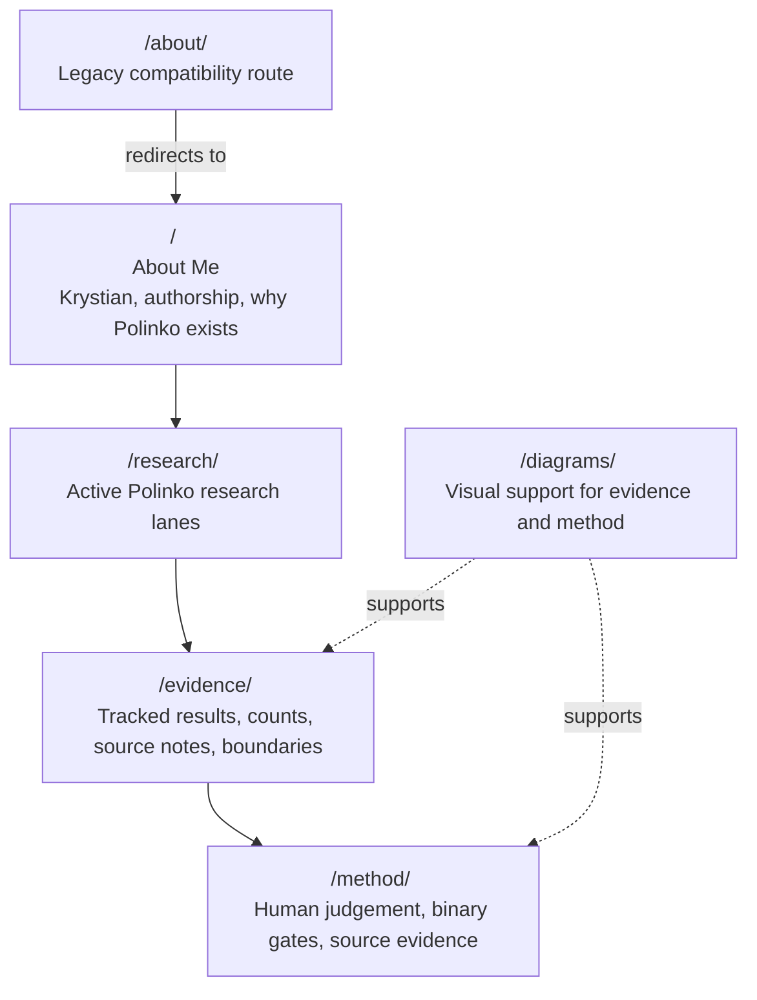

# krystian.io website source

This directory contains the static website published at
[krystian.io](https://www.krystian.io/).

The site presents Polinko as Krystian Fernando's human-led AI evaluation
research system: Polinko makes AI reliability observable by turning human
judgement into binary pass/fail gates. It tracks failures against source
evidence from prompt to output. The broader repository remains the research
record; this directory is the website layer.

## Route contract

The reader path is:

```text
/ -> /research/ -> /evidence/ -> /method/
```




Supporting routes:

- `/` owns Krystian, authorship, collaboration, and why Polinko exists.
- `/diagrams/` owns visual support tied back to the website pages.
- `/about/` redirects to `/` for compatibility with older links.

The homepage introduces Krystian first, then Polinko. Detailed research lanes
belong on `/research/`, result counts and source notes belong on
`/evidence/`, and human-judged binary gate mechanics belong on `/method/`.

## Build

Netlify builds the site with:

```bash
npm run build
```

The build copies `site/` into `dist/`.

## Check

Run the site contract check before publishing website changes:

```bash
npm run site:check
```
